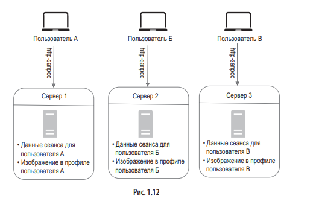
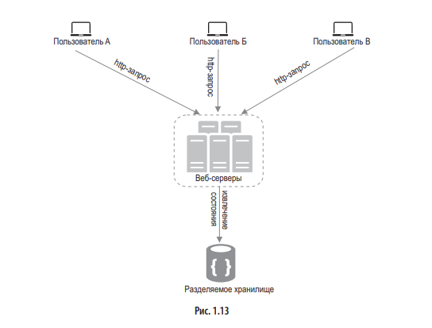

## Из чего состоит отправка 1-ого запроса клиента

* Пользователь формирует сам или при помощи фронта запрос, который состоит из:
	* Метод
	* URL
	* Заголовки
	* Тело запросу (body)
* Получение ip адреса на основе домена в __DNS__.
* Установление соединения через __TCP (Transmission Control Protocol)__
* Установление защищенного соединения __(SSL/TLS защиты)__
* Формирование HTTP запроса
* Получение запроса на балансировщике и распределение его на нужный сервер
* Шифрование через SSL/TLS запроса (если используется HTTPS)
* Дешифрование и проверка сообщения (MAC для HTTPS)
* Обработка запроса
* Шифрование ответа (также для HTTPS)
* Получение ответа браузером, его расшифровка и проверка (для HTTPS)
* Отображение ответа

## Репликация базы данных

### Типы реплицирования
- **Primary-Secondary (Master-Slave):**  
	Одна основная (мастер) база данных принимает все операции записи, а одна или несколько вторичных (реплик) синхронизируют данные с мастера и обслуживают запросы на чтение.
	_Преимущества:_ Простота реализации, хорошо подходит для распределения нагрузки на чтение.  
	_Недостатки:_ В случае отказа мастера требуется переключение (failover), а операции записи на вторичных узлах обычно недоступны.
- **Multi-Master (Master-Master):**  
    Несколько серверов могут одновременно принимать операции записи, а данные синхронизируются между ними.  
    _Преимущества:_ Позволяет распределять как операции чтения, так и записи, обеспечивает высокую доступность.  
    _Недостатки:_ Возможны конфликты при одновременной записи; требуется сложное управление согласованностью.
- **Clustered Replication:**  
    Применяется в распределённых системах (например, в NoSQL базах, таких как Cassandra или MongoDB), где данные реплицируются между узлами кластера, обеспечивая автоматическое распределение и отказоустойчивость.

Преимущества репликации базы данных: 
- Повышенная производительность. В модели «ведущий–ведомый» все операции записи и обновления происходят на ведущих узлах, а операции чтения распределяются между ведомыми. Это улучшает производительность, увеличивая количество запросов, которые можно обрабатывать параллельно. 
- Надежность. Если один из ваших серверов с базой данных сломается из-за стихийного бедствия, такого как тайфун или землетрясение, данные не будут утеряны. Вам не нужно беспокоиться о потере данных, так как они реплицируются по разным местам.
- Высокая доступность. За счет репликации данных по разным местам ваш веб-сайт будет продолжать работать, даже если одна из БД выйдет из строя, поскольку у вас по-прежнему будет доступ к данным, размещенным на другом сервере.

## Кэш

### Некоторые аспекты использования кэша
#### Когда будет использоваться кэш
Определитесь с тем, когда будет использоваться кэш. Это лучше делать в ситуациях, когда чтение данных происходит часто, а изменение — редко. В связи с тем, что кэш сбрасывается при перезапуске, данные необходимо записывать в постоянные хранилища.
#### Выбор срока действия кэша (TTL)
Просроченные данные немедленно удаляются. Срок действия лучше не делать слишком коротким, иначе система будет слишком часто обновлять данные, загружая их из БД. С другой стороны, из-за слишком длинного срока действия данные могут оказаться неактуальными.
#### Согласованность
Синхронизация данных в хранилище и кэше. Несогласованность может возникнуть из-за того, что операции изменения данных в хранилище и кэше выполняются не за одну транзакцию.
#### Предотвращение сбоев
Чтобы избежать SPOF (single point of failure), рекомендуется использовать несколько серверов кэширования, размещенных в разных центрах обработки данных (ЦОД). А еще можно выделить какой-нибудь дополнительный объем памяти: это создаст буфер на случай, если память начнет использоваться более активно.
#### Политика вытеснения
Когда кэш полностью заполнен, любой запрос на добавление новых элементов может привести к удалению существующих. Это называют вытеснением кэша. Самой популярной политикой считается вытеснение давно неиспользуемых данных (least-recently-used, LRU).

## Сессии
Данные сеансов клиентов __рекомендуется хранить в бд__, _так как иначе затрудняется горизонтальное масштабирование_

### Архитектура с сохранением состояния (на каждом сервере)

Чтобы клиент мог использовать сервер 1 и сервер 2, он должен аутентифицироваться на обоих из них, так как они не знают ничего друг о друге.
_Для решения проблемы, когда клиенту приходится аутентифицироваться несколько раз_, __балансировщики привязывают конкретного клиента только к определенному серверу__, но из-за этого может возникать множество проблем.

### Архитектура без сохранения состояния

В этой не хранящей состояние архитектуре пользовательские HTTP запросы __могут быть направлены любым веб-серверам__, которые __извлекают данные о состоянии из общего хранилища__. Хранилище отделено от веб-серверов.
__Такая архитектура позволяет значительно проще масштабировать систему горизонтально__.

## Центры обработки данных (ЦОД)
