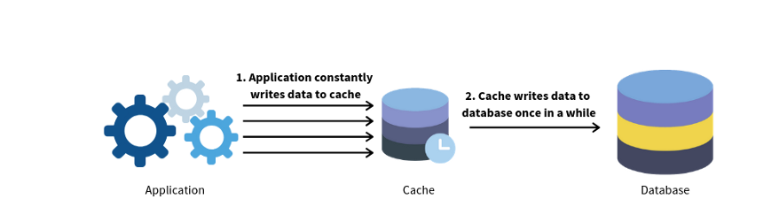
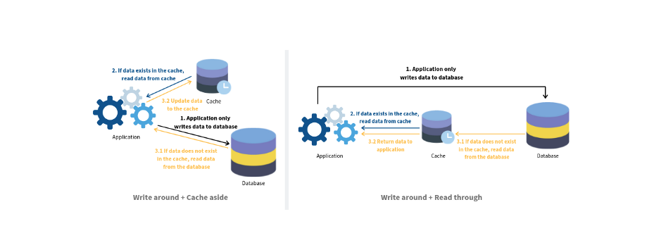

## Из чего состоит отправка 1-ого запроса клиента

* Пользователь формирует сам или при помощи фронта запрос, который состоит из:
	* Метод
	* URL
	* Заголовки
	* Тело запросу (body)
* Получение ip адреса на основе домена в __DNS__.
* Установление соединения через __TCP (Transmission Control Protocol)__
* Установление защищенного соединения __(SSL/TLS защиты)__
* Формирование HTTP запроса
* Получение запроса на балансировщике и распределение его на нужный сервер
* Шифрование через SSL/TLS запроса (если используется HTTPS)
* Дешифрование и проверка сообщения (MAC для HTTPS)
* Обработка запроса
* Шифрование ответа (также для HTTPS)
* Получение ответа браузером, его расшифровка и проверка (для HTTPS)
* Отображение ответа

## Репликация базы данных

### Типы реплицирования
- **Primary-Secondary (Master-Slave):**  
	Одна основная (мастер) база данных принимает все операции записи, а одна или несколько вторичных (реплик) синхронизируют данные с мастера и обслуживают запросы на чтение.
	_Преимущества:_ Простота реализации, хорошо подходит для распределения нагрузки на чтение.  
	_Недостатки:_ В случае отказа мастера требуется переключение (failover), а операции записи на вторичных узлах обычно недоступны.
- **Multi-Master (Master-Master):**  
    Несколько серверов могут одновременно принимать операции записи, а данные синхронизируются между ними.  
    _Преимущества:_ Позволяет распределять как операции чтения, так и записи, обеспечивает высокую доступность.  
    _Недостатки:_ Возможны конфликты при одновременной записи; требуется сложное управление согласованностью.
- **Clustered Replication:**  
    Применяется в распределённых системах (например, в NoSQL базах, таких как Cassandra или MongoDB), где данные реплицируются между узлами кластера, обеспечивая автоматическое распределение и отказоустойчивость.

Преимущества репликации базы данных: 
- Повышенная производительность. В модели «ведущий–ведомый» все операции записи и обновления происходят на ведущих узлах, а операции чтения распределяются между ведомыми. Это улучшает производительность, увеличивая количество запросов, которые можно обрабатывать параллельно. 
- Надежность. Если один из ваших серверов с базой данных сломается из-за стихийного бедствия, такого как тайфун или землетрясение, данные не будут утеряны. Вам не нужно беспокоиться о потере данных, так как они реплицируются по разным местам.
- Высокая доступность. За счет репликации данных по разным местам ваш веб-сайт будет продолжать работать, даже если одна из БД выйдет из строя, поскольку у вас по-прежнему будет доступ к данным, размещенным на другом сервере.

## Кэш
__Кэш__ — это слой временного хранилища данных, который по своей скорости работы намного опережает БД и сетевые запросы. К преимуществам отдельного уровня кэша можно отнести улучшение производительности системы, возможность снизить нагрузку на отдельные компоненты.

### Стратегии кэширования
#### Cache-aside - Кэш в стороне (ленивое кэширование на уровне приложения)
Приложение _сначала_ извлекает данные из кэша, прежде чем искать в базе данных. Если у нас есть _попадание в кэш,_ это означает, что данные найдены в кэше. В противном случае это _промах кэша_ . В этом случае приложение считывает данные из базы данных и обновляет содержимое кэша для будущих ссылок и возвращается в приложение. Это также известно как _ленивая загрузка_

**Плюсы**

1. Приложение работает даже в случае пропуска кэша _,_ но производительность снижается.
2. Поскольку благодаря отложенной загрузке в кэш записываются только запрошенные данные, это позволяет избежать заполнения кэша ненужными данными.
3. __Упрощается настройка кэширования под определенные сценарии для приложения.__

**Минусы**

1. Каждый _промах кэша_ приводит к заметной задержке.
2. __Изначально кэш будет пустым, что приведет к _промахам кэша_ для большинства запросов. В результате время задержки увеличится.__
3. __В каждом приложении потребуется реализовывать логику кэширования.__
4. __Может возникать логика не согласованности данных между кэшем в разных приложениях.__
#### Read Through Cache (ленивое кэширование на уровне сервера кэша)
В этой стратегии, когда есть попадание в кэш, приложение извлекает данные напрямую из кэша, как и раньше. В случае _пропуска кэша_ , здесь сервер кэша извлекает данные из базы данных, **а не из приложения** . Также после того, как данные извлекаются из базы данных, они сначала записываются в кэш, а затем возвращаются в наше приложение

**Плюсы**

1. __Логика кэширования уже реализована абстрактно на сервере кэширования и в приложении не нужно задумываться над самостоятельной реализацией.__
2. __Централизованное хранилище кэша (не нужно задумываться о том, как будут его использовать несколько приложений)__
3. Поскольку благодаря отложенной загрузке в кэш записываются только запрошенные данные, это позволяет избежать заполнения кэша ненужными данными.

**Минусы**

1. Если данные в базе данных изменились, в кэше могут присутствовать устаревшие данные. Необходимо быть уверенными, где используется кэш и что данные могут меняться только через сервер кэширования.
2. В случае промаха кэша приводит к заметной задержке.
3. __Аналогичная проблема, что кэш изначально пуст.__
4. __Менее гибкий контроль приложения за кэшированием данных.__ Могут требоваться специфичные настройки под определенные сценарии.
5. __Все приложения должны будут использовать механизм Read Through для сохранения согласованности.__

#### Write Through Cache (синхронная запись в кэш и бд)
__Очень похоже на Read Through Cache.__
Единственное отличие в том, что мы сейчас выполняем операцию записи. __Все операции записи сначала выполняются в системе кэширования, которая затем синхронно записывает в базу данных__. Это медленнее по сравнению с отложенной записью, но как только данные записаны в кэш, чтение тех же данных происходит быстро для обоих.

При запуске приложения кэш будет пуст, это можно решить несколькими способами:
- Прогрев кэша (запомнить содержимое бд в кэш)
- Комбинирование с Read Through Cache (если в кэше нет нужного значения, значит его еще не прогрели). В таком случае задержка будет только при первом вызове.

**Плюсы**  
1. Отсутствие _промахов кэша_ , поскольку данные всегда присутствуют (если был прогрев).  
2. Отсутствие устаревших данных в кэше (если был прогрев).  
3. Гарантируется согласованность данных, если они сопряжены со _сквозным чтением_ .

**Минусы**

1. Большая часть данных, находящихся в кэше, может никогда не быть запрошена.
2. Задержка записи увеличивается, поскольку приложению приходится ждать подтверждения записи от кэш-хранилища и базы данных.
3. Необходимо думать о заполнении кэш.

### Write Back / Write Behind (запись в кэш -> запись в базу с задержкой)
Операция записи сначала выполняется в кэше, но затем все данные записываются _асинхронно_ в базу данных через определенный промежуток времени

**Плюсы**

1. Устойчив к сбоям современных баз данных.
2. Снижение нагрузки и затрат за счет сокращения количества записей в базу данных.

**Минусы**

1. В случае любой прямой операции с базой данных мы можем столкнуться с использованием устаревших данных, что формально называется возможной несогласованностью между базой данных и сервером кэширования.
2. В случае сбоя кэша может произойти _безвозвратная потеря данных ._
### Write Around (запись только в бд, чтение только из кэша)
В write around приложение записывает данные напрямую в базу данных. А чтение данных проходит через кэш. Для операции чтения мы используем две стратегии кэширования, которые мы обсуждали. Поэтому обычно она сочетается либо со стратегией cache aside, либо со стратегией read-through.
