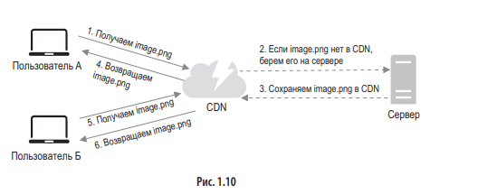

__Кэш__ — это слой временного хранилища данных, который по своей скорости работы намного опережает БД и сетевые запросы. К преимуществам отдельного уровня кэша можно отнести улучшение производительности системы, возможность снизить нагрузку на отдельные компоненты.

## Терминология 

- __cache miss - "промах кэша__". Сценарий, когда запрошенный ключ не был найден в кэше
- __cache hit - "попадание в кэш"__. Сценарий, когда запрошенный ключ был найден в кэше
- __hit ratio__ - % попаданий запросов в кэш. Характеризует эффективность кэширования.
- __горячий ключ__ - ключ, на который приходится бОльшая часть запросов
- __прогрев кэша__ - процесс наполнения кэша данными. Зачастую кэш прогревается либо при запуске системы заранее известными наиболее часто запрашиваемыми данными, либо по мере запросов(при частых или даже при первом cache miss)
- __инвалидация__ - удаление / обновление информации из кэша. Например, если в кэше находилось значение balance = 100\$, но пришел запрос на запись balance = 400\$, то очевидно что _после успешной записи_ нам необходимо инвалидировать это значение в кэше
## Стратегии кэширования

### Cache Through (ленивое кэширование через сервер кэширования)

__Приложение ничего не знает о бд, использует только кэш, а он уже отвечает за взаимодействие с бд.__
#### Read Through Cache 
В этой стратегии, когда есть попадание в кэш, приложение извлекает данные напрямую из кэша. В случае _пропуска кэша_ , здесь сервер кэша извлекает данные из базы данных, **а не из приложения** . Также после того, как данные извлекаются из базы данных, они сначала записываются в кэш, а затем возвращаются в наше приложение

#### Write Through Cache (синхронная запись в кэш и бд)
__Очень похоже на Read Through Cache.__
_Сначала данные записываются в кэш, а далее обновляются в кэше, все это происходит синхронно._

#### Плюсы

1. __Логика кэширования уже реализована абстрактно на сервере кэширования и в приложении не нужно задумываться над самостоятельной реализацией.__
2. Поскольку благодаря отложенной загрузке в кэш записываются только запрошенные данные, это позволяет избежать заполнения кэша ненужными данными.
3. Требуется синхронизация между кэшом и бд.
4. Соблюдается актуальность данных в кэше.

#### Минусы

1. В случае промаха кэша приводит к заметной задержке.
2. __Кэш изначально пуст.__
3. __Менее гибкий контроль приложения за кэшированием данных.__ Могут требоваться специфичные настройки под определенные сценарии.
4. __Запись довольна требовательная, за счет необходимости синхронизации данных в кэше и бд__
5. __Если кэш упал - то приложение не сможет получить данные.__

### Cache Aside (ленивое кэширование на уровне приложения)
#### Cache-aside (Read aside) - Кэш в стороне 
Приложение _сначала_ извлекает данные из кэша, прежде чем искать в базе данных. Если у нас есть _попадание в кэш,_ это означает, что данные найдены в кэше. В противном случае это _промах кэша_ . В этом случае приложение считывает данные из базы данных и обновляет содержимое кэша для будущих ссылок и возвращается в приложение. Это также известно как _ленивая загрузка_

#### Write aside (Запись на стороне)
__Аналогично Write Through, но пишет в отдельный модуль отвечающий за кэширование__

#### Плюсы

1. Гибкость. __Управление полностью в руках приложения. Оно может сохранить данные в кэш сразу после обращения к БД, а может предварительно сделать еще ряд манипуляций __с данными и только затем сохранить их в БД
2. Приложение работает даже в случае недоступности кэша.
3. Поскольку благодаря отложенной загрузке в кэш записываются только запрошенные данные, это позволяет избежать заполнения кэша ненужными данными.
4. __Упрощается настройка кэширования под определенные сценарии для приложения.__

#### Минусы

1. Каждый _промах кэша_ приводит к заметной задержке.
2. __Изначально кэш будет пустым, что приведет к _промахам кэша_ для большинства запросов. В результате время задержки увеличится.__
3. __В каждом приложении потребуется реализовывать логику взаимодействия кэша и бд.__

### Write Back / Write Behind (запись в кэш -> запись в базу с задержкой)
Операция записи сначала выполняется в кэше, но затем все данные записываются _асинхронно_ в базу данных через определенный промежуток времени

**Плюсы**

1. Устойчив к сбоям современных баз данных.
2. __Снижение нагрузки и затрат за счет сокращения количества записей в базу данных__.

**Минусы**

1. В случае любой прямой операции с базой данных мы можем столкнуться с использованием устаревших данных, что формально называется __возможной несогласованностью__ между базой данных и сервером кэширования.
2. __В случае сбоя кэша__ может произойти _безвозвратная потеря данных ._
### Write Around (запись только в бд, чтение только из кэша)
__Приложение записывает данные напрямую в базу данных__. А чтение данных проходит через кэш. Для операции чтения мы используется либо стратегия cache aside, либо стратегия cache through.
Может пригодится в системах с большим объемом данных, где они часто записываются, но читаются не так часто.

__Плюсы (преимущества)__
1. **Снижение «загрязнения» кэша.** Экономится память в кэше, за счет игнорирования запоминания новых записанных в бд значений.
2. **Сокращение нагрузки на кэш при большом количестве записей:** Запись выполняется довольно быстро
3. Простая реализация

__Минусы (недостатки)__
1. При **первом запросе** данных после их обновления в базе они отсутствуют в кэше. Часто возникает __cache miss__
2. __Данные в кэше могут быть не актуальны__, так как после записи в бд, нет обновления кэша
### Cache Ahead (асинхронное обновление кэша)
__Эта стратегия предназначена только для запросов на чтение. Они всегда идут только в кэш,__ никогда не попадая в БД напрямую. По факту __мы работаем со снимком состояния БД и обновляем его с некоторой периодичностью__. Для приложения это выглядит просто как хранилище, как и в случае Cache Through.
Можно комбинировать с другими Write стратегиями.

#### Преимущества:

1. Минимальная и полностью контролируемая нагрузка на БД. __Клиентские запросы не могут повлиять на БД.__
2. __Всегда быстрый ответ на read запросы__
3. В коде легко добавить/убрать кэш, поскольку можно просто заменить кэш на основное хранилище и обращаться уже к нему

#### Недостатки:

1. __Кэш часто может быть не актуален__. Он отстает от основного хранилища __на период между запусками обновления кэша__. Нужно помнить, что на момент обращения __свежие данные могут еще “не доехать” до кэша__. Эта проблема может быть решена использованием сквозной записи или записи на стороне. Тогда, при обновлении данных в БД, данные будут обновляться и в кэше.
2. Требует очень много памяти.

## Стратегии инвалидации
__Инвалидация__ – это процесс удаления данных из кэша или пометка их как недействительных. Делается это для того, чтобы гарантировать актуальность данных, с которыми работает приложение.

### По TTL
__TTL (Time To Live) – время жизни данных в кэше__. При сохранении данных в кэш для них устанавливается TTL и данные будут обновляться с периодичностью не менее TTL.
### По событию
При таком подходе __данные инвалидируют при наступлении некоего события__ – обычно это обновление данных в источнике. На самом деле, мы уже рассмотрели этот способ, когда говорили про стратегии использования кэширования, а именно write through и write aside.

Также в качестве события для инвалидации данных может выступать время последней модификации данных. Такой способ используется в HTTP.
## Стратегии вытеснения
__Размер кэша ограничен__, он гораздо меньше основного хранилища, а значит, мы не может разместить в нем все данные. Что делать, когда память, выделенная под кэш, полностью заполнена, а новые записи продолжают поступать?

### Random
Random – стратегия вытеснения, при которой удаляются случайные записи. Это самая простая стратегия: просто удаляем то, что первым попалось под руку. Но этот способ недалеко ушел от стратегии “ничего не делать”.

### TTL
TTL – стратегия вытеснения, предусматривающая удаление той записи, которой осталось меньше всего “жить”, то есть у которой TTL истечет раньше всех. Как и random, эта стратегия немного лучше, чем “ничего не делать”, но все еще недостаточно эффективна.

### LRU
__LRU (Least Recently Used) – стратегия вытеснения, которая опирается на время последнего использования записи. Она удаляет записи, у которых время последнего использования старше остальных__. Таким образом, в кэше остаются записи, которые использовались недавно. Эта стратегия опирается уже не на случай, а на паттерн использования данных, поэтому она гораздо эффективнее предыдущих.

__Эта стратегия хорошо подходит, когда__:
- недавно использованные данные, скорее всего, будут использованы снова в ближайшем будущем
- нет данных, которые используются чаще остальных
- вы не знаете, что именно вам нужно

### LFU
LFU (Least Frequently Used) – стратегия вытеснения, опирающаяся на частоту использования записи. Она удаляет записи, которые использовались реже всего. Так в кэше остаются данные, которые использовались чаще других.

Эта стратегия хорошо подходит, когда есть данные, которые используются значительно чаще остальных. Такие данные разумно не вытеснять из кэша, чтобы избежать лишних “походов” в источник.

### FIFO
Первый вошел - первый вышел
(__Очередь__)

### LIFO
Первый вошел - последний вышел
(__Стэк__)

### Алгоритм Белади (Belady's Optimal Algorithm)
Алгоритм Белади — это **утопический идеальный алгоритм кэширования**, который всегда выбрасывает ту запись, которая **не понадобится дольше всего** в будущем. Представь, что ты играешь в шахматы и знаешь все ходы соперника наперед — ты бы всегда делал идеальные ходы. Так и здесь: если система каким-то магическим образом знает, какие данные понадобятся, она может идеально управлять кэшем, не допуская лишних промахов.

Но в реальной жизни этот алгоритм **нереализуем**, потому что никто не может предсказать будущее с абсолютной точностью. Однако он важен как **верхняя граница эффективности**

### Кэширование ошибок
Представим себе, что клиент запрашивает данные, которых нет в источнике. Пусть это будем информация о товаре по id. Казалось бы, нет данных и ладно: просто сходим в источник, ничего не получим и сообщим клиенту. Но что, если таких запросов много? А что, если кто-то делает это специально?

Это типичная схема так называемой атаки через промахи кэша (cache miss attack). Ее суть в запрашивании данных, которых заведомо не может быть в кэше, поскольку их нет в источнике.

Также кэширование ошибок полезно, если сервис, к которому вы обращаетесь, “почувствовал себя плохо”. Чтобы не забивать его запросами, которые, скорее всего, не будут выполнены, а лишь усугубят проблему, лучше кэшировать ошибки на несколько секунд

## CDN (Content Delivery Network)
__CDN__ - __это сеть географически распределённых серверов__, предназначенная для быстрой и надёжной доставки цифрового контента, чаще всего статического (изображений, видео, статических файлов веб-приложений: html, css, js и т.д.)
_Главная цель CDN_ — **уменьшить задержку и повысить скорость загрузки** за счёт доставки контента с «ближайшего» к пользователю узла. Ускоряет за счет кэширования файлов на внешних серверах.

Пример: отправка запроса из Сиднея в Лондон будет лететь более 300 мс, а если разместить CDN сервер поблизости, то может менее 50 мс.

### Архитектура
- Edge-сервера (узлы CDN) - это дата-центры, расположенные ближе всего к крупным городам и узлам сети.
- _Каждый Edge-сервер имеет кэш_ (обычно послойный), в котором хранятся запрашиваемые пользователями файлы.
- __При запросе контента CDN перенаправляет пользователя к ближайшему__ (или наиболее доступному с точки зрения сети) узлу, откуда и выдаётся ресурс.****
- Origin-сервер (исходный сервер), где находится «оригинал» контента
- _Если Edge-серверу требуется файл, которого у него нет_ (cache miss), _он запрашивает его на Origin-сервере_, кэширует у себя и выдаёт пользователю.
- Есть механизмы инвалидации и TTL.

### Преимущества

- **Повышение скорости загрузки**
    - Меньшая задержка за счёт близости к пользователю.
    - Актуальные протоколы и сжатие при передаче данных.
- **Надёжность и масштабируемость**
    - Выделенная распределённая инфраструктура CDN-провайдера выдерживает пиковые нагрузки, отключения узлов, сетевые сбои и сетевые атаки.
- **Снижение нагрузки на основной сервер
    - Собственный сервер (Origin) обрабатывает меньше запросов, основная часть статического трафика уходит на CDN. Это может уменьшить требования к хостингу и пропускной способности канала.
- **Защита от атак**
    - CDN может блокировать DDoS, сканирования и прочий вредоносный трафик на периферии (edge), не загружая основной сервер.

### Недостатки

- **Стоимость**
    - __Практически все CDN-тарифы платные (чаще всего крупные корпорации их продают).__
- **Сложность конфигурации**
    - Нужно правильно настроить DNS, CNAME-записи, правила кэширования, проверять, что весь статический контент корректно отдаётся через CDN.
- **Кэширование динамического контента**
    - CDN в первую очередь эффективен для статических файлов. Динамические страницы (контент, который часто меняется) сложнее кэшировать. Некоторые решения (Edge Functions, Key-Value хранилища на Edge и т.д.) пытаются эту проблему частично решать, но это усложняет логику.
- **Задержка при обновлении**
    - Если нужно срочно выложить новую версию файла, бывает, что CDN продолжает отдавать старую копию из кэша, пока не сработает инвалидация или не истечёт TTL.
- **Зависимость от CDN-провайдера**
    - Если у CDN-провайдера случился массовый сбой (что бывает редко, но бывает), ваш сайт может стать недоступным или работать нестабильно.